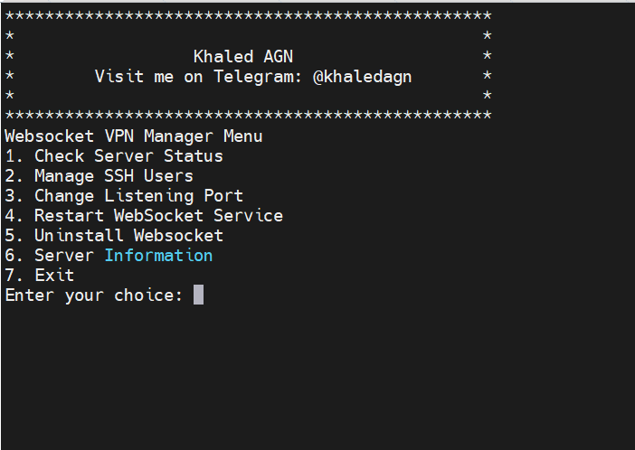

# WebSocket VPN Manager

WebSocket VPN Manager is a bash script utility designed to manage a Python-based WebSocket proxy service on Linux servers. It provides a menu-driven interface for checking server status, managing SSH users, changing listening ports, restarting services, and uninstalling the proxy script.

# Client app AGN INJECTOR

<p>
<a href="https://play.google.com/store/apps/details?id=com.agn.injector"></a>
</p>

## Features

- **Check Server Status:** Monitor the status of the WebSocket service.
- **Manage SSH Users:** Add and remove SSH users with ease.
- **Change Listening Port:** Modify the port used by the WebSocket service.
- **Restart WebSocket Service:** Restart the WebSocket service after configuration changes.
- **Uninstall Python Proxy Script:** Completely remove the WebSocket proxy script and its associated files.
- **Server Information:** Display detailed information about the WebSocket service including its current status and listening port.

## Installation

Follow these steps to install and use the WebSocket Service Manager:

### Prerequisites

- Linux server with systemd support (tested on Ubuntu)
- `bash` shell
- `curl` for downloading files
- `awk`, `sed`, `grep` for text processing
- `systemctl` for managing services
- Python 3 with `pip` installed

### Installation Steps

1. **Download the Installation Script:**

   Use `wget` to download the installation script and `chmod` to make it executable:

   ```bash
   wget https://raw.githubusercontent.com/khaledagn/AGN-SSH-Websocket-VPN/main/install.sh
   chmod +x install.sh

2. **Run the Installation Script:**

   Execute the installation script with root privileges. This script will install necessary packages, download the WebSocket proxy script (agn_websocket.py), create systemd 
   service files, and set up the command-line utility.
   
   ```bash
   sudo ./install.sh

### Usage
After installation, run the WebSocket Service Manager using:

     ```bash
     websocket menu

Follow the menu options displayed on-screen to manage your WebSocket service effectively.

### Screenshots



### Support and Maintenance

This project is maintained by Khaled AGN. For updates and support, visit:

<ul>
 <li>TELEGRAM CHANNEL: https://t.me/khaledagn</li>
 <li>FACEBOOK: https://www.facebook.com/itskhaledagn</li>
 <li>INSTAGRAM: https://www.instagram.com/khaledagn</li>
 <li>TWITTER: https://www.twitter.com/khaled_agn</li>
 
 </ul>


